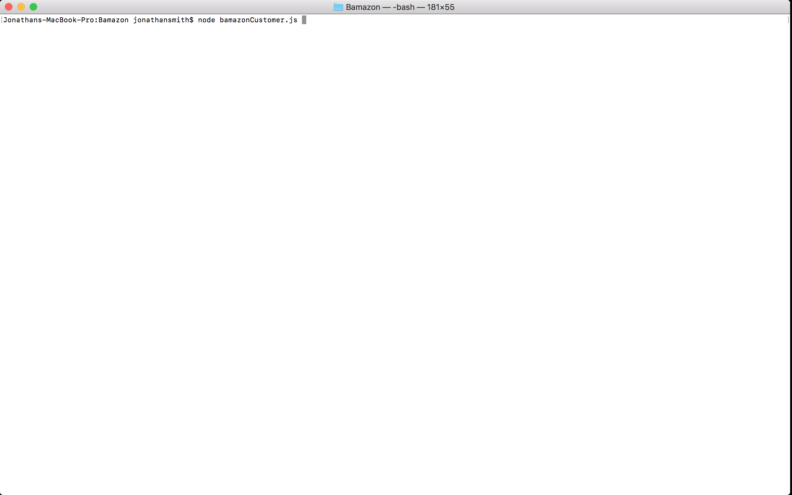
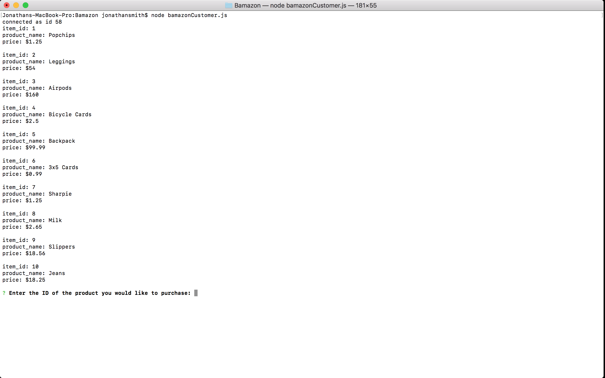
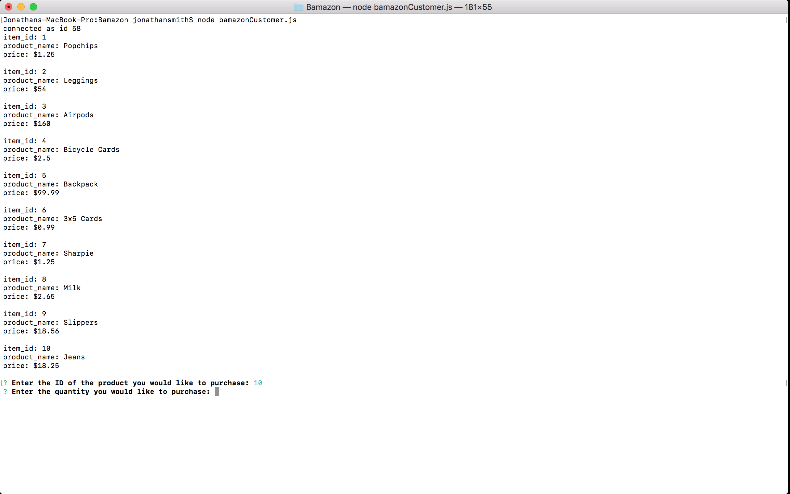
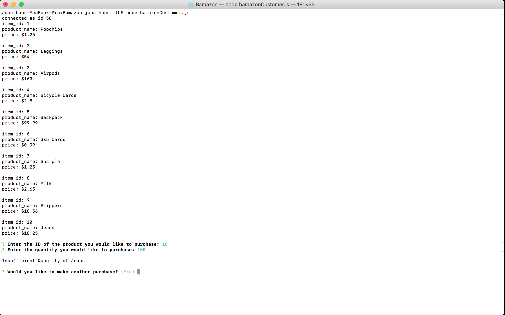
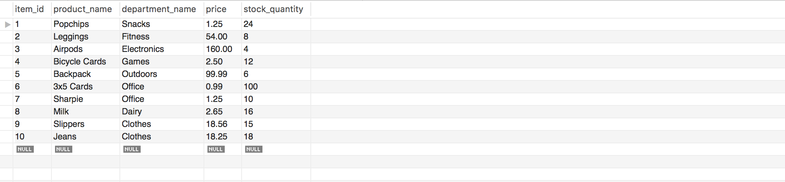
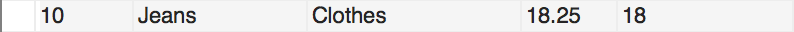
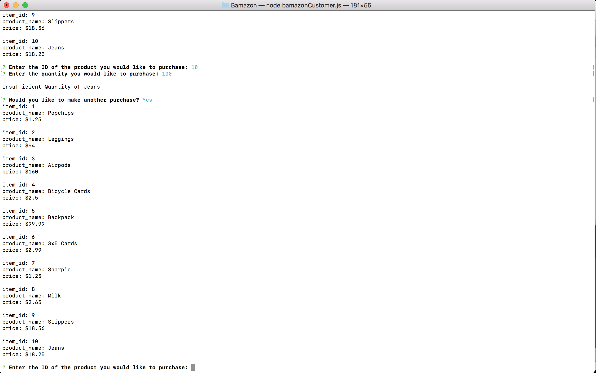
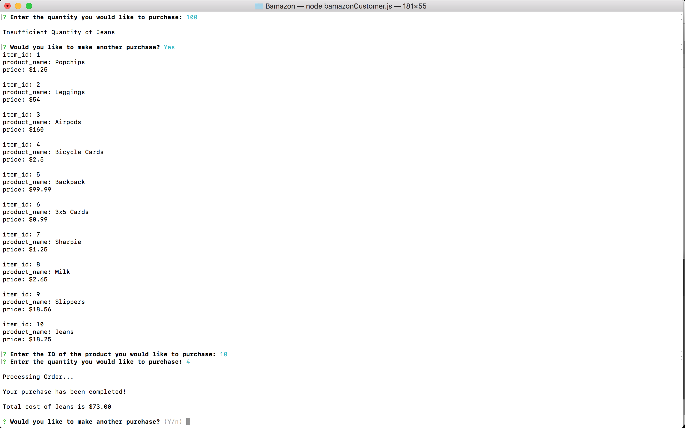
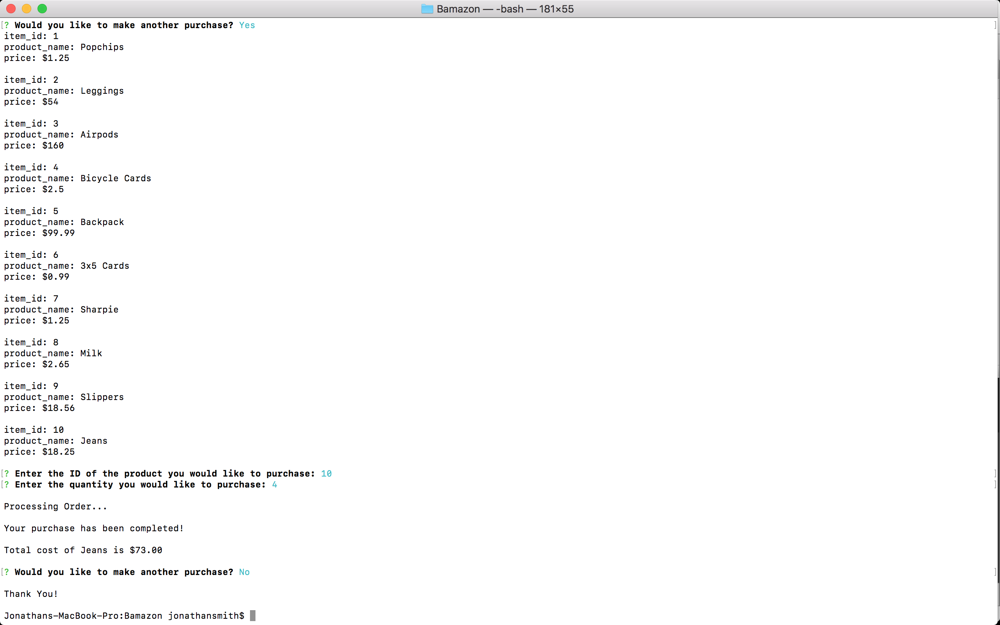
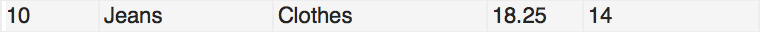

# Screenshots of App Flow

### Run node bamazonCustomer.js

### Enter Product ID Number

### Enter Quantity Number

### Notice insufficient Quantity

### Here is database seed data

### Here is Jean(ID 10) specific data

### Enter Product ID again

### Enter Quantity and Notice Results

### Closing

### Notice Jean(ID 10) Quantity Updated

